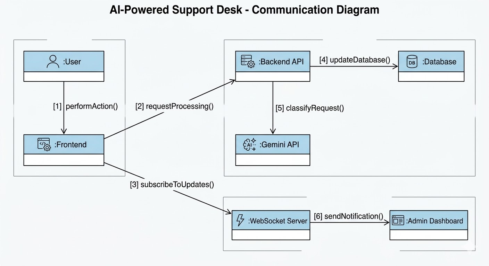
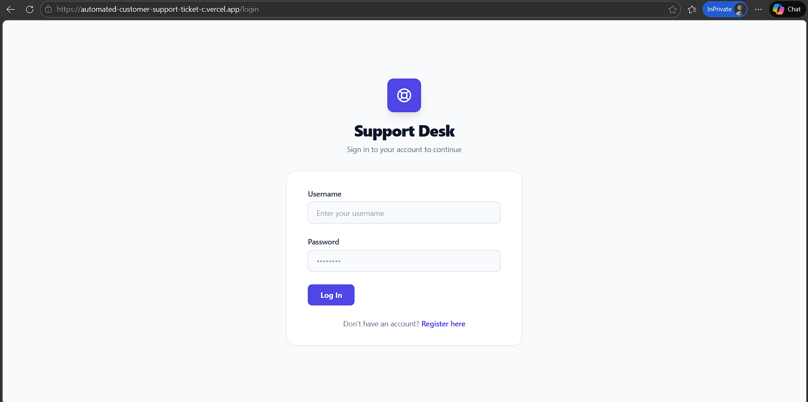
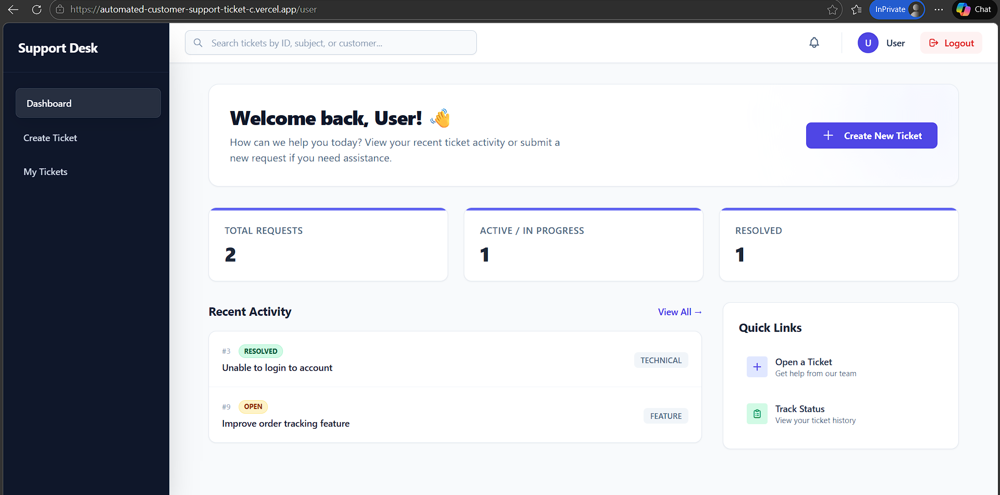
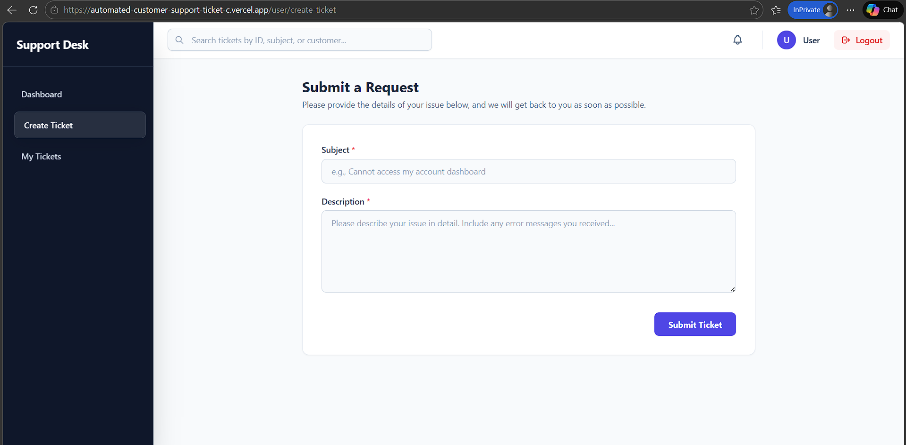
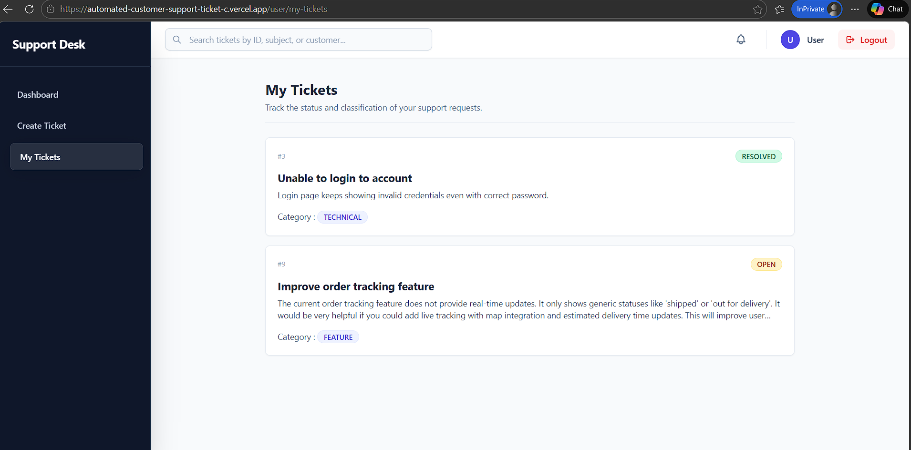
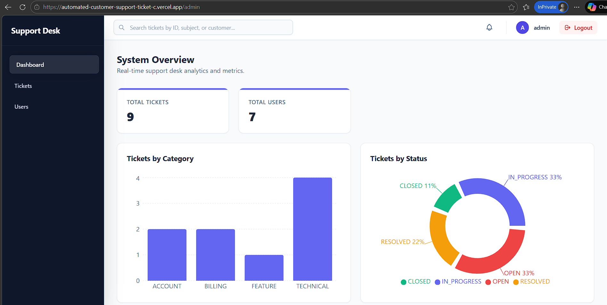
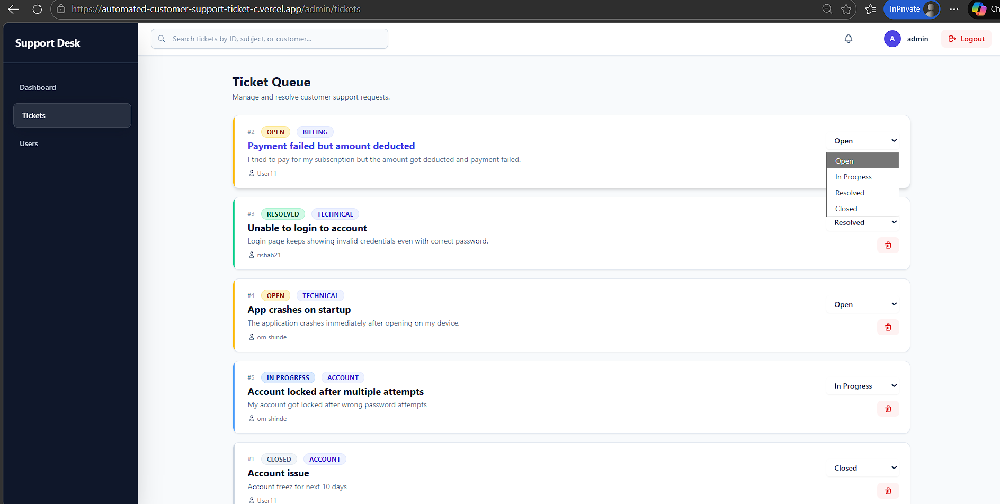
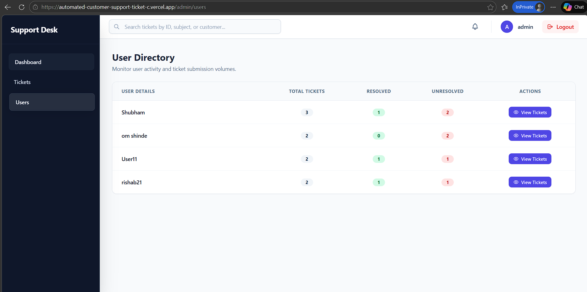

# 🚀 Automated Customer Support Ticket Classification System

A full-stack AI-powered customer support system that automates ticket classification, prioritization, and management with real-time updates and role-based access control.
 

---

## 🌐 Live Demo

- 🔗 Frontend: https://automated-customer-support-ticket-c.vercel.app/
- 🔗 Backend API: https://support-desk-backend-jsnh.onrender.com/actuator/health
- 📊 API Docs (Swagger): https://support-desk-backend-jsnh.onrender.com/swagger-ui/index.html

---
## ❗ Problem Statement

Traditional customer support systems rely heavily on manual ticket triaging, leading to:
- Support teams face a large volume of incoming tickets that require manual review for categorization. 
- Manual assignment delays resolution and creates bottlenecks.

---

## 💡 Solution

This system automates the entire ticket lifecycle using AI and real-time architecture:
- This project automates the "Triage" phase using Generative AI,  while ensuring security through RBAC (Role-Based Access Control) and transparency through Audit Logs.
- AI-based ticket classification (category, priority, confidence)
- Role-based system for Users, Agents, and Admins

---

## 🔥 Features & Functionalities

### 👤 Authentication & Security
- User Registration & Login
- JWT-based Authentication (Access + Refresh Tokens)
- Role-Based Access Control (USER, ADMIN)
- Secure API endpoints with Spring Security

### 🔒 Secure Role-Based Access: 
 Implements Spring Security with JWT.

- User: Can only submit and view their own tickets.  
- Admin: Can view all tickets, update ticket status and view analytics.

---

### 🎫 Ticket Management System
- Create support tickets
- Automatic ticket classification using AI (Gemini API)
- Priority assignment (LOW / MEDIUM / HIGH)
- Ticket status lifecycle:
    - OPEN → IN_PROGRESS → RESOLVED → CLOSED

---

### 👨‍💼 Admin Features
- View all tickets
- Update ticket status
- Delete tickets
- Search tickets (by keyword/user)
- View user-wise ticket history

---

### 📊 Analytics Dashboard
- Total number of tickets
- Total number of users
- Tickets by category (Bar Chart)
- Tickets by status (Pie Chart)
- Daily ticket trends (Line Chart)

---

### ⚡ Real-Time System
- WebSocket-based live updates
- Instant ticket updates across users/admins
- Notification bell for new tickets

---

### 🔍 Advanced Features
- Search functionality across tickets
- Audit logging (track all actions)
- Global exception handling
- Health monitoring with Spring Actuator
- Swagger API documentation

---

## 🛠️ Tech Stack

### 🚀 Backend
- Java 21
- Spring Boot 3
- Spring Security + JWT
- Spring Data JPA (Hibernate)
- PostgreSQL (Supabase)
- WebSocket (STOMP + SockJS)
- Gemini API (AI classification)

---

### 💻 Frontend
- React (Vite)
- JavaScript
- Axios (API handling)
- React Router
- Tailwind CSS

---
### Tools: 
- Docker
- Git
- Postman
---

### ☁️ Deployment & DevOps
- Backend: Render (Dockerized)
- Frontend: Vercel
- Database: Supabase (PostgreSQL)
- CI/CD: GitHub Actions

---

## 🔄 Application Flow

1. User registers / logs in
2. JWT token is generated and stored
3. User creates a ticket
4. AI (Gemini API) classifies:
    - Category
    - Priority
    - Confidence score
5. Ticket saved in database
6. Admin/Agent receives real-time update
7. Admin updates ticket status
8. Ticket auto-closes after 48 hours (if resolved)

---

## 🏗️ Architecture

### 🔹 High-Level Architecture
Frontend (React - Vercel)  ↓   Backend (Spring Boot - Render)    ↓   External AI (Google Gemini API)   ↓  Database (PostgreSQL - Supabase)

## System Design Diagram 

## Sequence Diagram (Ticket Creation Flow)

##  Communication Diagram

---

### 🔹 Backend Architecture

- Controller Layer → Handles API requests
- Service Layer → Business logic
- Repository Layer → Database interaction
- Security Layer → JWT + RBAC
- WebSocket Layer → Real-time updates

---

### 🔹 Frontend Architecture

- Pages (Login, Register, Dashboard)
- Components (Navbar, Sidebar, Tickets)
- Context API (Auth management)
- API Layer (Axios client)
- WebSocket client

---

## 🔐 Demo Credentials

### 👨‍💼 Admin
username: admin  
password: admin123

### 👤 User
username: user11  
password: 123

---

## ⚙️ Environment Variables

### Frontend (.env)

VITE_API_URL=https://support-desk-backend-jsnh.onrender.com

---

### Backend (Render ENV)

DB_URL = your_database_url  
DB_USERNAME = your_username  
DB_PASSWORD=your_password  
GEMINI_API_KEY = Your_ApiKey  
JWT_SECRET = Your_Secret  
JWT_EXPIRATION = e.g.86400000

---

## Outputs
- Login page : 
  
 

- User dashboard page :
  

 

- Create Ticket page :
  

 

- View My Tickets page :
  

 

- Admin Dashboard page :
  

 

- View all Tickets page :
  

 

- View Users page :
  

---
## 📌 Future Enhancements

- Email notifications
- File attachments in tickets
- Ticket assignment system
- AI chatbot integration
- Multi-tenant support

---
## 🤝 Contributing
Contributions are welcome! Feel free to open an issue or submit a pull request.

---

## 👨‍💻 Author

**Shubham Shirsath**  
Full Stack Developer | AI Enthusiast
  
GitHub: https://github.com/Shubh-003  
LinkedIn: https://www.linkedin.com/in/shubham-shirsath-32576622b/---

---
## ⭐ If you like this project

Give it a ⭐ on GitHub — it helps a lot!